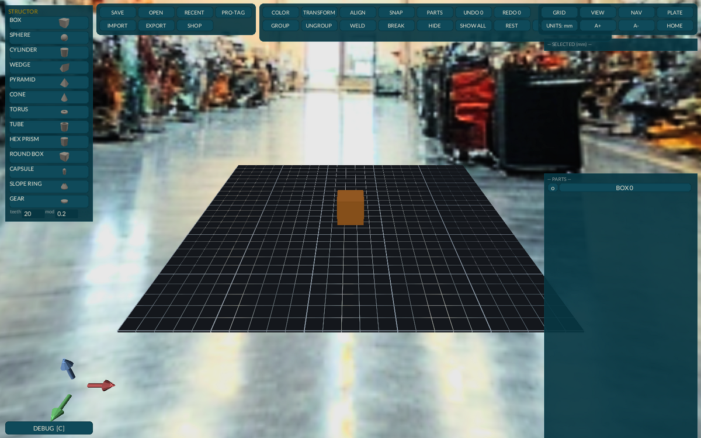

# Structor

Current release: 0.11.0

*The design module of the Livyatan Design Suite. Draw a part, mark the
holes, merge, export. It runs on your machine — no subscription, no
account, no cloud.*

## Hardware — Tier 0

Any Debian-family box. No GPU required, no network, nothing to sign up
for. Measured on real hardware, not guessed:

| machine | class | time to painted UI |
|---|---|---|
| T1000 8GB workstation | mid | ~1.2 s |
| GTX 1650 desktop | low | ~1.1 s (software rendering) |
| Strix Halo 128GB | high | runs; instant |



## Quickstart

```
sudo apt install ./structor_0.9.0_amd64.deb
structor
```

The window opens on an empty build plate. Click a palette button — BOX,
SPHERE, CYLINDER, WEDGE, PYRAMID, CONE, TORUS, TUBE, HEX PRISM, ROUND
BOX, CAPSULE, SLOPE RING, or GEAR (set teeth and module first) — and a
solid lands on the plate. Left-drag moves it, rings rotate it, the
bounding-box handles scale it. Press **H** to turn the selected solid
into a HOLE that cuts whatever it overlaps. Select everything, merge,
**EXPORT STL**. **SAVE** / **OPEN** on the toolbar keep the scene as a
`.SigN` file (default folder `~/Structor`; Ctrl+S / Ctrl+O), and the
scene autosaves to `~/Structor/autosave.SigN` once a minute when it has
changed. **HIDE** takes the selected parts out of the viewport while you
work on what is behind them; **SHOW ALL** brings them back. The parts list
under the palette hides and selects by name, **REST** drops a part onto the
plate, **FIT ALL** frames everything, **MEASURE** reads a distance, and
new parts arrive at one inch with the keyboard already in their size fields.
Hover any toolbar button for its keyboard chord; **A+ / A-** scale the text of
every Livyatan module.

`RUNBOOK.md` walks a complete worked example — a wall bracket that the
rest of the suite picks up module by module.

## Files

- **`.SigN`** — the native save format: your scene tree as readable
  JSON-CSG, not an opaque blob. Open it in a text editor. SAVE / OPEN on
  the toolbar; `~/Structor/autosave.SigN` is written for you.
- **`.stl`** — watertight export (import too). The boolean engine is
  manifold — the same backend OpenSCAD uses — so the preview IS the
  export.
- **`.obj`** — export for tools that prefer it.

## Config

Mouse and SpaceMouse feel live in the NAV panel and persist to
`~/.config/structor/nav.json`. A SpaceMouse is detected automatically
when present; the app is fully usable without one.

## Why this exists

The author wanted alternatives to paid services and subscription
programs.

## Known limitations

- Primitive-solid modeling (the TinkerCAD idiom): no sketch-and-extrude,
  no fillets on arbitrary edges — the shape vocabulary is the palette.
- STL import renders as-is; imported meshes join booleans but are not
  parametrically editable.
- Single-window, single-scene per instance.

## License

See the suite `LICENSE.md` at the repository root (PolyForm Small
Business 1.0.0).

## Support the work

Ko-fi: [ko-fi.com/3DJ77](https://ko-fi.com/3DJ77)
